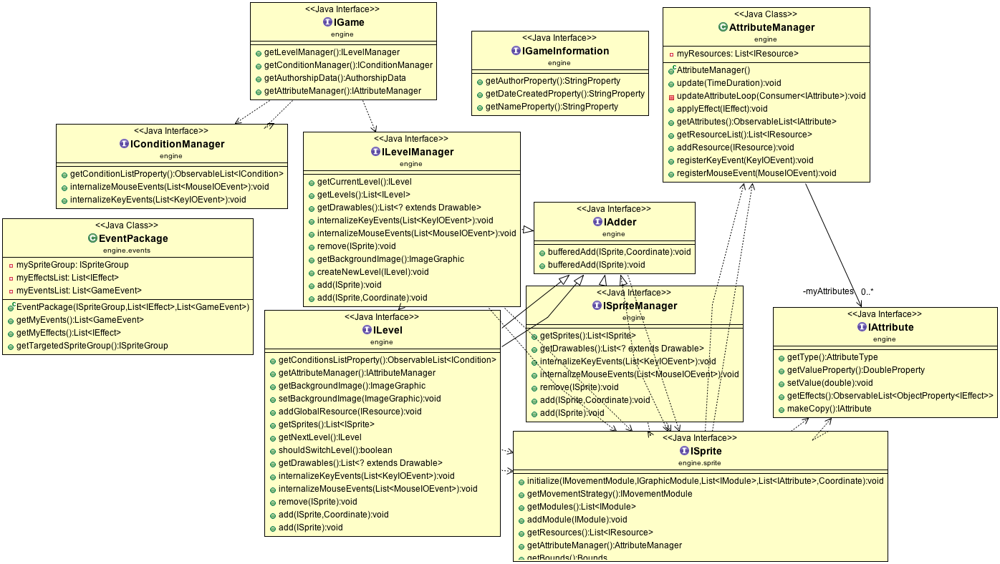
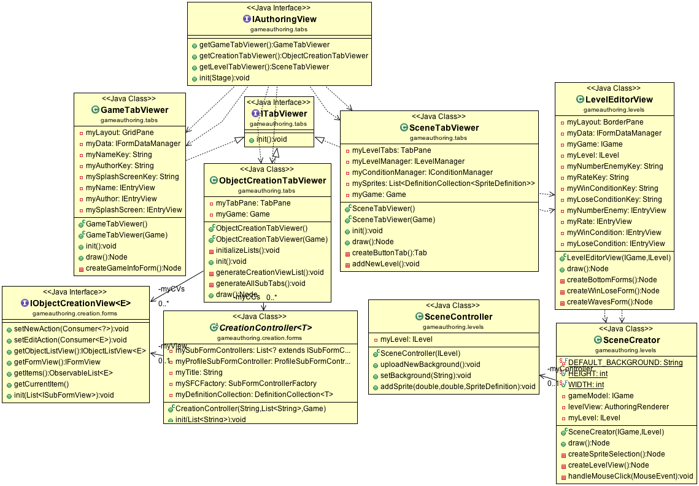
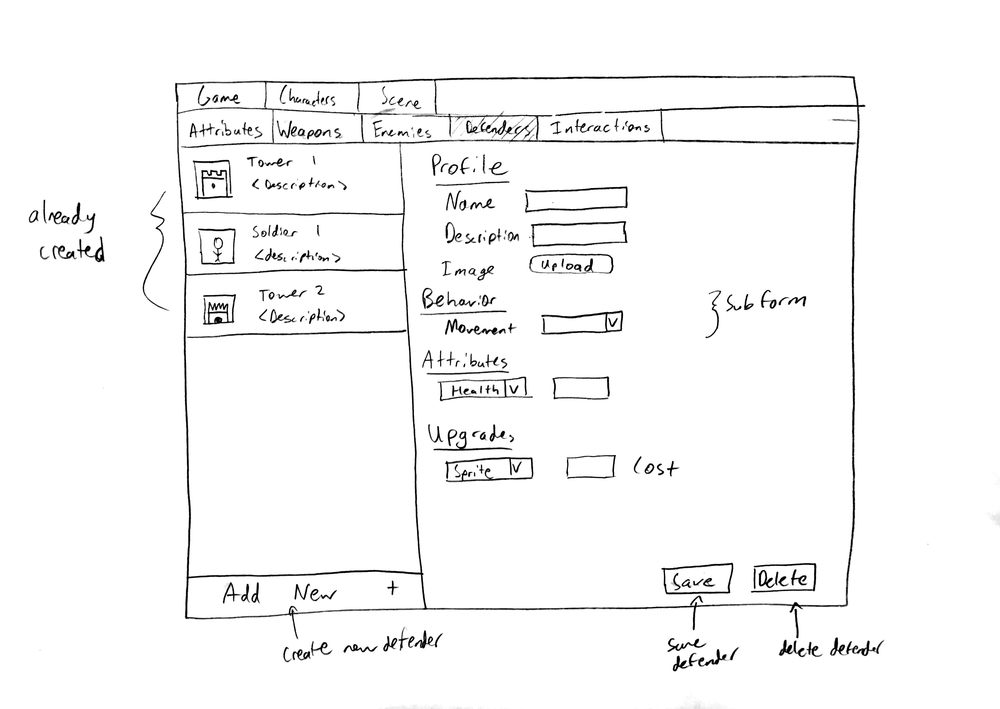
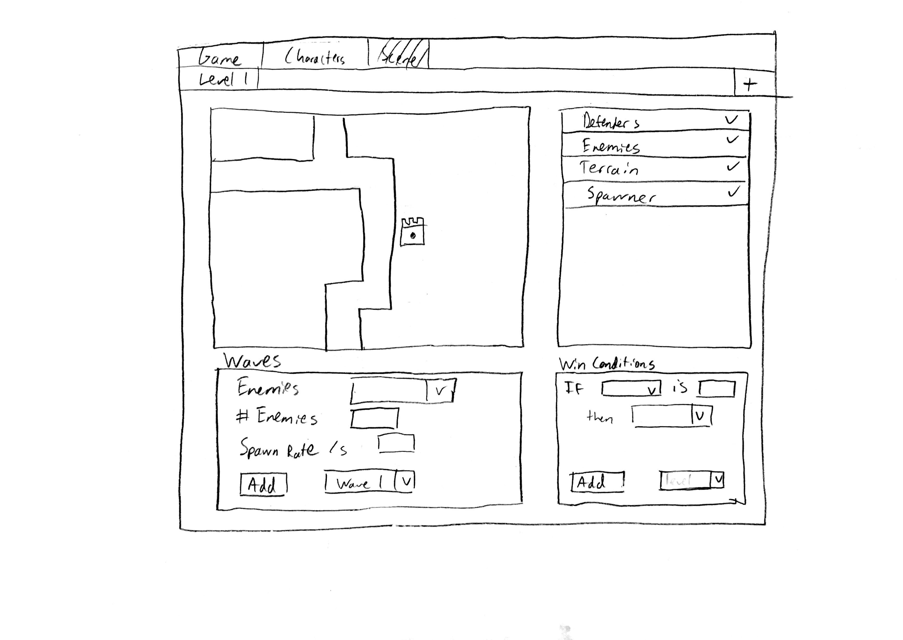
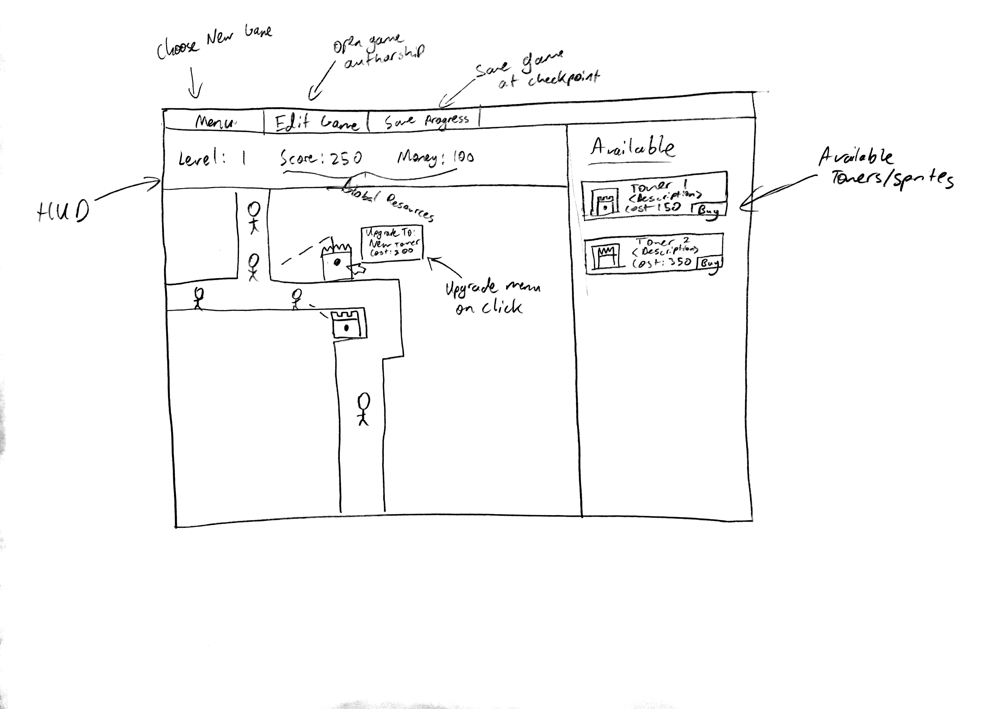

###Introduction
(G)it Depends seeks to build a flexible and powerful game creation and playing environment.  This environment will be founded upon a flexible game engine, and a comprehensive game-authoring environment.  The game engine will be able to can interpret and run a wide array of games with different actors, rules, and goals.  The authoring environment will provide an extremely broad amount of flexibility to allow users to create actors and levels with as few limitations pre-defined parameters as possible.  The games created will be run through an easy-to-use and intuitive game player, which will contain a library of previously created games for the user to choose from.  The primary design goals of (G)it Depends are to provide users the most flexibility possible in creating robust, complex games.  

The primary architecture of our design lies in the idea that games can be constructed of Sprites, Conditions, Effects, and Attributes.  A Sprite is anything that appears on the game screen when the game is played, ranging from a soldier, to a tower, to a menu.  Sprites, and the global state of the game, possess Attributes.    Attributes are numerical values that can be used to represent a broad variety of various aspects of Sprites or the global state of the game.  For example, Attributes could represent ammunition remaining for a rifleman, the number of lives the user has remaining, or health.  Effects define how the Sprites interact with each other and the game state, primarily via numerical operations on Attribute values.  Some examples of effects would be decreasing the value of health, moving on the screen, or removing a Sprite from the screen entirely.  Conditions define when Sprites impose effects on one another and the game state.  Together Effects and Conditions define the “rules” for the game.  The game engine will interpret and run games based on these assumptions and the game-authoring environment will allow the user to create games utilizing these objects.  

(G)it Depends has chosen to focus it’s efforts on building an environment suited for Tower Defense games.  There are many unique aspects to the Tower Defense genre as a whole that our environment will need to support.  First off, Tower Defense games allow for the user to modify the state of the level by placing towers and actors on the screen to aid in their defense.  Therefore the state of the game’s level needs to be extremely dynamic.  Tower Defense also depends on waves of enemies moving in a random fashion towards an objective, and conversely having the defense actors and towers be “smart” enough to destroy as many of those enemies as they can in an intelligent fashion.  Finally Tower Defense games are grounded in strategy, so there needs to be a great deal of flexibility in how a user can accomplish reaching the winning condition of a level.

###Overview

Our three UML diagrams highlight how we intend on dividing the program and how we expect the individual parts to interact with each other. To create the desired functionality that we delineate in our latter parts of the design document, we focused on splitting our design discussions and layouts into two sub-groups. We created an engine sub-group that focused largely on understanding and conceptualizing the schema for the back-end, the model, and how we would render actors onto the screen and create effects. The authoring sub-group focused on how the user would interact with the GUI in regards to setting up the actors in the game, specifying levels, and create conditions and effects for a responsive and interactive gaming experience. 

####Engine Sub-Team

#####Game Model UML

#####Game Player UML

The Game player UML serves to highlight the interactions within the game engine. We use interfaces to communicate and interact with our purported hierarchy. We have an IGamePlayer interface that will launch the game. The interface is dependent upon the IGame we pass it. This game interface will interact the IGamePlayable class to retrieve information, drawables, and attributes that our engine will render onto the screen. We also have a IGraphicFactory that will interact with the IRenderer to convert back-end model nodes into its corresponding visuals. The IRenderer will then take the visuals and display them onto the screen. Finally we have the IGameEngine (covered more in-depth in another UML) that plays and pauses the game. 

#####Authoring Sub-Team

###User Interface

When designing our user interface, we wanted something both simple for the user and well designed from us. Though our engine may be able to support very complex interactions, our game authoring environment and game player will present the game in an easy to use way. Our game authoring environment (shown below) is separated into a few tabs. There are three "main" tabs that can bring the user to define the main 3 parts of the game: the general game information, characters & objects, and the levels. To keep with the Model View Controller design paradigm, each "sub part" of the authorship will have its own view and controller, independent of the others. In the first tab, for general game information, the user will be able to define basic things about the game like title, author, and certain rules. The second tab will have multiple forms for creating objects of the game like global/character attributes (health, money, etc), enemies, defenders, obstacles and interactions. Each form will look the same way and inherit from the same interfaces. The basic layout will be a list on the left that will show previously created items and a form on the right where the user can create a new item. The list will show the previously created items in a presentable way. For example, for enemies and defenders, it would show a "cell" with the picture, name and description of the enemy. The form is made out of subforms to make it modular. For example, enemies and game attributes would both have a "Profile" subform to fill out the name, description, and photo. And, if the user ever wants to go back and edit a created item, he/she just has to click on the cell in the list and the form will be auto-populated with information. Then, he/she can click "Save" or "Delete" for the item. The interactions also work in the same way as this, except the form is more dynamic. To create an action, the user will specify a sprite, then a condition, then an action that occurs. Because there's a complex tree of interactions that can happen, the subforms will be generated algorithmically. For example, if the user wanted to define an action that ended the game, no more information is needed. But, if the user wanted to define an action that damages an enemy, the user would need to specify what enemies and how much damage.

In the last main tab, there will be the forms to create levels (shown below). On the top will be tabs to represent the created levels, and a "+" tab to add a new one. Each level will have a background image to upload to represent the general scene. On the right hand side, there will be a series of drop down lists to select and drag different items created from the previous slide like enemies, defenders, and terrain. These can be dragged onto the scene to be placed into the level. Additionally in this pane, there will be an option to drag "spawners" onto the screen. These are invisible sprites that can generate new enemies as actions. The user will get to specify what enemies are generated from that spawner and a path for enemies to follow from that spawner. On the bottom are two other tiles. The first is the "Waves" section. This is where the user can create different waves of enemies very easily by specifying which enemies, the number of them and how fast they come. Multiple waves can be created for a level. The second tile is the "Win/Lose Condition" section. This is where the user should specify how the game either ends or continues. Each is presented in an "If ____ is ____ then win/lose". This way, the user can specify very complex game ending conditions and they can be different for each level.

The game player is actually quite a simple interface for the user and will follow nicely from the game authoring environment. The top of it has a menu bar to do certain control actions like save the game, switch to editing, or choose a new game. Then in the middle is the actual game view. The center has the level view, where the action occurs. This is where towers and defenders are dropped and the game animates. Above this is the HUD, which is dynamic based on the game. It at least displays the user info and the score. Additionally, it will show any global attributes of the game created by the user like lives, mana, or money. On the right hand side is the sprite picker. This is where the user can drag and drop any selectable sprite onto the game map. Note that we are not restricting what can be in that picker, but it is up to the user to define. This will almost be exactly like the right tile of the level creation tab in the authorship environment. The sprites will be draggable and there may be a series of drop down lists to group things.

###Design Details
* To launch a game, you first start out by launching a GameLibrary. The GameLibrary displays a collection of games that are queried from a specified repository (by looking for xml files). When a user chooses a game to play, it will launch a game engine and pass it the specified IGame object, which it creates by using xScript to deserialize the game from xml. The game engine contains an internal timeline loop that tells the game to update, and then asks for its renderable objects. It passes those objects to a renderer, which uses a factory design to convert them into JavaFX Nodes. The GamePlayer will allow for high level game functionality such as pausing and resuming, and eventually (not necessarily first sprint) allowing a user to launch an editor and edit the game in progress. 

* For an IGame, the key components that it contains are a generic representation of its information (name, author, date created), and an ILevelManager. It will also contain an IConditionManager and an IGameState that handle any game-wide interactions and resources. From there, the ILevelManager contains components that manage the specific levels. A Level handles the sprites that it contains, as well as any level-specific interactions and attributes. Sprites will contain a generic group of modules that define that sprite's behavior, but the modules will take care of all of the actual implementation and action. Every Sprite has to have a module that handles its movement (even if the concrete implementation of that is just stationary, as well as one that handles its status (dead or alive, but not necessarily tied with health). Conditions will contain direct references to the objects they need to rely on, and a condition check to see whether or not they should pass an effect to those references. Effects will have internal concrete logic that specifies which attributes they act on and how to do so. Additionally, user interaction events such as clicks or key input will be passed down through the same framework and conditions/sprites will be responsible for responding to those events as necessary. 

 
###Example Games

1. Bloons
2. Villainous 
3. Defend Your Castle 

*Bloons* 

[Play here](http://ninjakiwi.com/Games/Tower-Defense/Play/Bloons-Tower-Defense-5.html#.Vv2ZihIrKLI)

In bloons there are towers that are represented by monkeys.  For example, there are monkey that throw darts, fly planes that drop missiles, etc.  The bloons follow a path on the screen.  They spawn at the beginning of this path and attempt to make it all the way to the end without being popped by the monkeys' attacks. 

To create bloons in our environment an author would first make the custom Sprites that represent the monkeys and balloons.  The author then would make the necessary collisions between them.  To do such the author would specify the collisions and what attributes are effected in the collision, chosen from a pre-set list of effects such as decrease, increase, and damage proportionally. 

In bloons the amount of lives decreases if a balloon reaches the end of the path.  The author would define the global attribute lives.   Then the author would define a location condition that checks the location of each balloon and fires a decrease effect to the global lives upon the condition being met (balloon reaches the end of path location).

To get the desired path following the author would first upload the desired background image.  This would contain the image of the path to be followed.  Next, a path would be defined for the balloons to follow.  This path will be made by the author, as the authoring environment allows he/she to graphically create a path.  This path would be interpolated as a set of finite points and given to each of the balloons.  This path would be associated with the balloons movement algorithm. 

In bloons you can upgrade monkeys, giving them better functionality and a new image.  We imagine supporting this by allowing the user to create a linked list of custom Sprites they have made that define the upgrade path. 

*Villainous*

This is a prime example of an anti-game.  In this game the user can place the enemies that attempt to get to the end of the path. In our authoring environment we allow the author to decide which Sprites can be placed by the user during game-play.  To accomplish this anti-game the user would put enemies, not towers, in this side panel of options.  Then, the author can make the necessary conditions to associate enemy behavior with good user scores/outcomes.

[Play here](http://www.kongregate.com/games/rete/villainous)

*Defend Your Castle* 

[Play here](http://www.xgenstudios.com/play/castle)

In Defend Your Castle there is one castle that the user has control over.  There are waves of enemies that attack the towers health directly.  The user can update the castle to better fortify against these enemies.  The author can create this game by creating one castle and a list of enemies.  The enemies will have a path that goes directly to the tower.  The author will set the collision between enemies and health to effect the castles health.  Lastly, the user will tie the ending condition of the game to the health of the tower.

Others:

These are other examples of classical/successful tower defense games.  We will be able to support these games for similar reasons listed above.

* [FieldRunner](http://subatomicstudios.com/games/fieldrunners/)

* [Plants vs Zombies](http://www.miniclip.com/games/plants-vs-zombies/en/)

###Design Considerations 

####Engine Sub-team Meetings

Over the course of our meetings, the strongest ambiguities and concerns we attempted to address were collision detection, how to classify events or effects in regards to our sprites, and numerous nuances about how the engine would handle clicks and user-input, changing levels, and access management. 

During our initial conversations, we discussed how we wanted to handle the notion of attributes. At first, we discussed maintaining private instance variables that serve as generic attributes such as health and movement. Focusing on generalizing the notion of attributes, we introduced the notion of an external condition manager. These conditions essentially maintain the information involving the sprites or group of sprites, the effect, and any global attributes that may be altered. 

In regards to a few design patterns, we discussed trade-offs between the strategy design pattern and a combination of the composition and visitor pattern to handle how we implement the notion of behavior. We decided that we wanted unilateral dependencies that moved downwards from the game to each individual sprite. We believe this prevented any untraceable altercations that occur if we pass references up the hierarchy and wait for it to trickle back down. We decided to run with the composition design pattern with sprites to attach various modules, such as weapons or movement. 

Additionally, we are strictly adhering to interfaces for our sprites, modules, conditions, and components of the engine. During one of our meetings, we heavily discussed our hierarchy beginning with the player and moving down at a high-level into the game engine and the components below the engine component. We discussed tradeoffs on how we want to pass condition and collision information between our managers, the level, and the sprites and its attributes. We decided that we would create a condition and collision manager that holds a list of all of the users' effects and events for that level. By doing so we would be able to prevent passing information up to the level and back down to the sprites. Our solution holds the affected sprites attributes, a list of effects, a method to check if the condition or collision is met, and where else the condition needs to be applied.

We also held significant discussion about the notion of a level and how we would differentiate what a level and a splash screen entails. We defined splash screens as interstitial screens with texts and bottoms that allow the user to segue between levels. The problems that elucidated from this discussion created issues with our model. We didn't feel comfortable having a renderer in our game engine that rendered Sprites onto the screen and text and buttons. We didn't want to abstract the renderer to account for the differences because we would introduce complications between our level manager and how the authoring environment would create the notion of a splash screen. 

####Authoring Sub-team Meetings

On the authorship side, there are still a few issues that need to be addressed before we finish our basic implementation. First, we need to make very clear our hierarchy of model-view-controllers for the game authorship. Making multiple model-view-controllers will be quite tricky and we had a very lengthy discussion about whether the view has the controller or the controller has the view or neither. We decided that each view should have a controller that works independently of any other controller. We felt this best separated JavaFX code and normal code. Also, since the model is just the one created by the engine, we will just use that one instead of making our own.

The other issue that was discussed at length was how to deal with dynamic forms to create objects, and especially interactions. Because interactions vary widely and some take values and some don't, this created a complex 'tree' quite similar to SLogo. We discussed whether supporting these dynamic forms was worth the trouble (it would make the controller quite complex too) or if we should give one standard form for everything. We decided that we should not be limiting the user's choice, so we will have to come up with a way to reveal different sub forms and parse the information accordingly. So, we will try to use sub forms like in the other creation tabs, but these just aren't always there.

Lastly, we have not discussed validation among the authoring environment yet. Meaning, there is no current plan for how we will monitor forms being filled out correctly or if the game is ready to be saved to an XML. Though this will probably just mean adding in functionality to our form controllers and overall controller, it's still a discussion that may need to be had.

####Overall Considerations

Going forward, the discussions we are having entail input from both sub-groups. One of the topics we are discussing is the notion of paths for sprites and our interpretation of spawners. Additionally, we are going to have to deliberate on how we the authoring environment constructs the XML files and how the engine team uses reflection and other techniques to interpret the property files for the specified game. 

On the authorship side, there were some design conversations that occurred because we didn't yet have created classes yet in the engine. I think once we have a more concrete idea of some of the objects that are being created (like mover or firing modules), these discussions will end. Understanding how to store form and sub-form data is a problem we are tackling on the authoring environment. We need to abstract an appropriate way to interpret sprite information, wave or level information, and data about winning conditions.